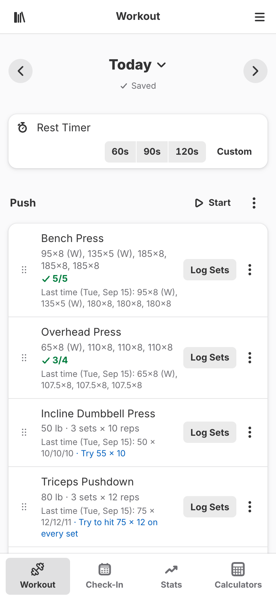
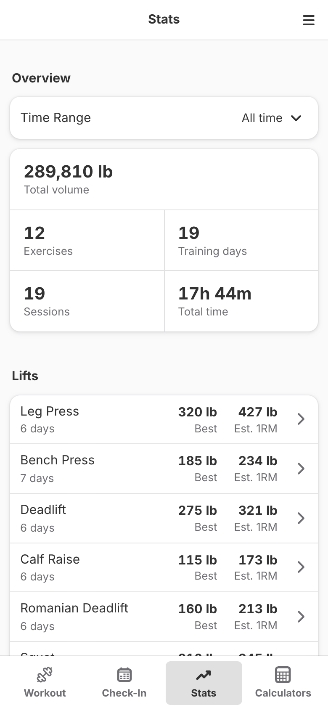

# workout-tracker

[](https://github.com/chaezuha/workout-tracker/actions/workflows/ci.yml)
[](LICENSE)

A self-hosted, installable workout log built with React and Supabase. Log
workouts, track progress, and time your rests from your phone or desktop.

<p align="center">
  <picture>
    <source media="(prefers-color-scheme: dark)" srcset="docs/screenshots/workout-dark.png">
    
  </picture>
  &nbsp;
  <picture>
    <source media="(prefers-color-scheme: dark)" srcset="docs/screenshots/stats-dark.png">
    
  </picture>
</p>

## Features

- **Set-by-set logging:** Split each day into sessions, log weight and reps per set, mark warm-up, working, and drop sets, and record effort as RPE or RIR. Drag exercises to reorder them.
- **Progress hints:** Each exercise shows what you did last time and suggests the next weight to try. A toast celebrates every new personal record.
- **Timers:** A rest timer between sets and a workout timer that records how long each session took.
- **Saved workouts:** Save a day's exercises as a named workout and load it into any other day.
- **Check-ins and stats:** Check in each day you train and see your streak on a calendar. See totals and per-exercise history over any time range.
- **Calculators:** Work out which plates to load on the bar, plus BMI and TDEE (metric or imperial).
- **Share and back up:** Share a session summary as an image, and export or import your full history as CSV.
- **Works anywhere:** Install it as an app, keep logging offline (changes sync when you reconnect), try it as a guest without an account, and pick light, dark, or system style with an accent color.

## Quick start

You need Docker with Compose and a free [Supabase](https://supabase.com) account.

1. Create the Supabase project. The app stores its data there.
   1. Sign in at [supabase.com](https://supabase.com) and create a **New Project**.
   2. Open the **SQL Editor** and run the migrations in order:
      [`0000_init.sql`](supabase/migrations/0000_init.sql) (base tables),
      [`0001_sessions.sql`](supabase/migrations/0001_sessions.sql) (sessions), then
      [`0002_set_data.sql`](supabase/migrations/0002_set_data.sql) (per-set logging).
      All three are safe to re-run on a project that already has the tables.
   3. Under **Settings → API**, copy the **Project URL** and the **anon/publishable key**.
2. Download the config and start the app. You don't need to clone the repo or install Node.

   ```sh
   mkdir workout-tracker && cd workout-tracker                                             # a folder for the app
   curl -O https://raw.githubusercontent.com/chaezuha/workout-tracker/main/compose.yaml     # the compose file
   curl -o .env https://raw.githubusercontent.com/chaezuha/workout-tracker/main/.env.example # your settings
   nano .env                                                                               # paste in your Supabase URL and anon key
   docker compose up -d                                                                    # pull the prebuilt GHCR image and start it
   ```

That's it. Open [http://localhost:8080](http://localhost:8080) and create an
account, or tap **Continue as Guest** to try it first.

> **Stuck on "Check your email to confirm your account"?** Supabase requires
> email confirmation by default. Click the link in the email, then sign in. For
> a private instance you can turn off **Confirm email** in your Supabase
> project's Auth settings instead.

If your Docker setup needs root, prefix the `docker` commands with `sudo` or
add yourself to the `docker` group.

## Usage

| Page        | Path           | What you do there                                                            |
| ----------- | -------------- | ---------------------------------------------------------------------------- |
| Workout     | `/`            | Log today's sessions, exercises, and sets. Load saved workouts. Start timers. |
| Check-in    | `/checkin`     | Check in for today and see your streak and past check-ins on a calendar.     |
| Stats       | `/stats`       | See totals for a time range and open any exercise's history.                 |
| Calculators | `/calculators` | Plate loading, BMI, and TDEE.                                                |

The main menu holds the style and accent color pickers,
**Import History…** and **Export History…** (CSV), sign in, sign up, or sign
out, and **About**. Importing never overwrites a day that already has data, so
re-importing an export is safe.

**Guest mode:** Your data stays in the browser on that device only. When you
later sign in, the app offers to import your guest workouts into the account.

**Accounts:** Anyone who can reach the app can sign up. Each account can only
read and change its own data (enforced by row-level security in Supabase).
See [Security](#security) to limit sign-ups.

## Configuration

For Docker, settings go in the `.env` next to `compose.yaml` (see
[`.env.example`](.env.example)). For the Node dev server, they go in
`frontend/.env.local` (see [`frontend/.env.example`](frontend/.env.example)).

| Variable                 | Required            | What it does                                                                                    |
| ------------------------ | ------------------- | ----------------------------------------------------------------------------------------------- |
| `SUPABASE_URL`           | yes (Docker)        | Project URL from **Settings → API** in the Supabase dashboard. No default.                      |
| `SUPABASE_ANON_KEY`      | yes (Docker)        | The anon/publishable key from the same page. No default.                                        |
| `PORT`                   | no                  | Host port the app is served on. Default `8080` in Docker, `5173` for the dev server.            |
| `VITE_SUPABASE_URL`      | yes (Node dev)      | Same value as `SUPABASE_URL`, for the dev server or a source build. No default.                 |
| `VITE_SUPABASE_ANON_KEY` | yes (Node dev)      | Same value as `SUPABASE_ANON_KEY`, for the dev server or a source build. No default.            |

Your Supabase credentials are injected when the container starts (they are not
baked into the image), so switching projects is just an edit to `.env` and
another `docker compose up -d`.

> [!WARNING]
> Only use the **anon/publishable** key. It is sent to every browser that opens
> the app, which is safe because row-level security protects the data. Never
> put the `service_role` key in either `.env` file: it bypasses row-level
> security and would give anyone full access to your database.

## Other ways to run

### Build the image from source

To build the image yourself instead (for example, to run local changes):

```sh
git clone https://github.com/chaezuha/workout-tracker.git
cd workout-tracker
cp .env.example .env                                     # then edit .env and paste in your Supabase URL and anon key
docker build -t ghcr.io/chaezuha/workout-tracker:latest .
docker compose up -d --pull never                        # --pull never keeps your local build
```

The build also accepts `--build-arg VITE_SUPABASE_URL=YOUR_SUPABASE_URL` and
`--build-arg VITE_SUPABASE_ANON_KEY=YOUR_ANON_KEY` if you want the values baked in.
Values from `.env` at startup still take priority.

### Run directly with Node

You'll need Node.js 22+. Then install, configure, and run:

```sh
git clone https://github.com/chaezuha/workout-tracker.git
cd workout-tracker/frontend
npm install
cp .env.example .env.local  # then edit .env.local and paste in your Supabase URL and anon key
npm run dev
```

The dev server runs at [http://localhost:5173](http://localhost:5173). The dev
server doesn't run the service worker, so to test the production build, offline
support, and the install prompt, use `npm run build && npm run preview` instead.

## Running it long-term

### Updating

The compose file sets `pull_policy: always`, so re-running `up -d` doubles as
the update command:

```sh
docker compose up -d          # checks the registry and pulls a newer image if one exists
```

Every push to `main` is also published as `ghcr.io/chaezuha/workout-tracker:sha-<full commit hash>`.
To stay on a fixed version, replace `:latest` in `compose.yaml` with one of
those tags.

If an update adds a new file under [`supabase/migrations/`](supabase/migrations),
run it in the SQL Editor before you pull the new image.

### Restarts and health

The compose file sets `restart: unless-stopped`, so the app comes back on its
own after crashes and reboots. A healthcheck polls `/healthz` every 30 seconds.
Check the status with:

```sh
docker compose ps             # STATUS shows "healthy" once the app is up
```

### Logs

```sh
docker compose logs -f        # follow logs
```

### Backups

Everything lives in your Supabase project, not in the container.
`docker compose down`, rebuilds, and image updates never touch your workout
history. To keep your own copy, use **Export History…** in the app's main menu
to download a CSV, and use Supabase's own backups for the whole database.

### Security

- **Use HTTPS.** Put the app behind a reverse proxy with TLS if you open it
  beyond localhost. Browsers only allow installing the app and using it offline
  over HTTPS (or on localhost).
- **Limit sign-ups.** If the instance is just for you, create your account,
  then turn off new user sign-ups in your Supabase project's Auth settings.
- **Keep keys straight.** See the [warning under Configuration](#configuration).

## Development

```sh
cd frontend
npm install
npm run lint        # eslint
npm test            # vitest unit tests (no network needed)
npm run test:watch  # re-run tests on change
npm run build       # production build into dist/
```

CI runs lint and tests on every push to `main` and every PR. Pushes to `main`
also publish the multi-arch (amd64 and arm64) Docker image to GHCR.

## License

[MIT](LICENSE)
